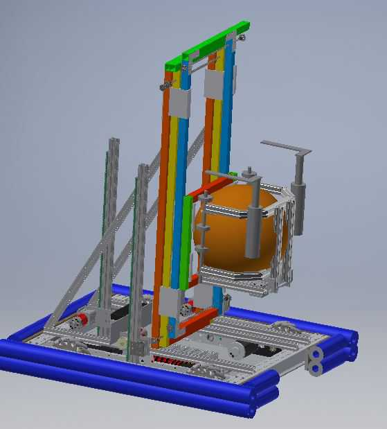

# Stealth 2019
Robot Code for the 2019 FRC season

## Cool Features :
### Motion Paths for auto
These are paths that we generated to move our robot during auto. They use the gyro and encoders on drive left and drive right to get the robot where it needs to go.
### Complete Logging System
We log everything! This is helpful because we know exactly what is going on with the robot. It can also be used to make sure everything is accurate.
